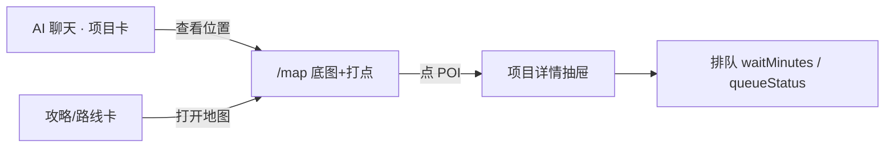
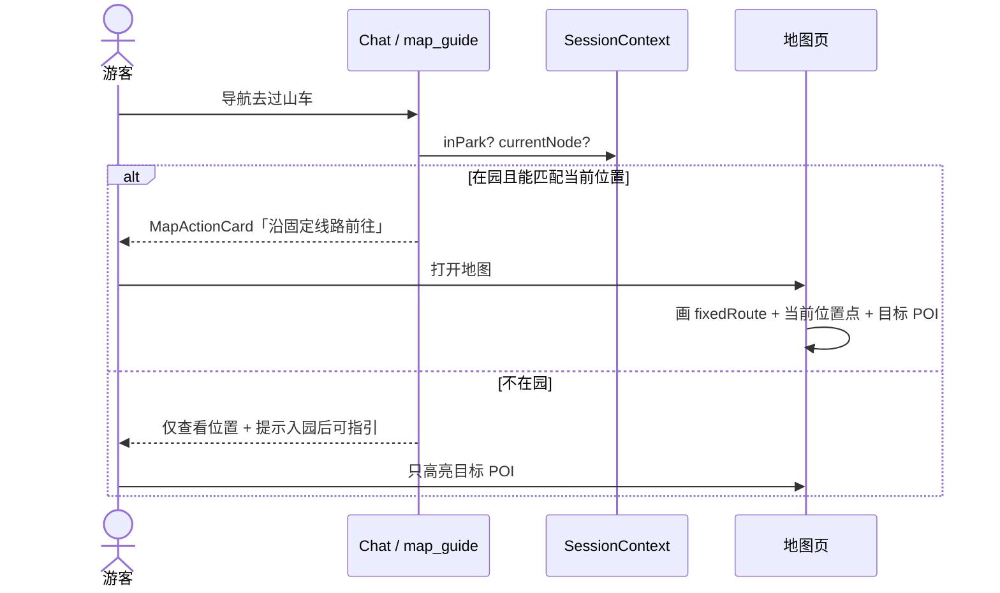
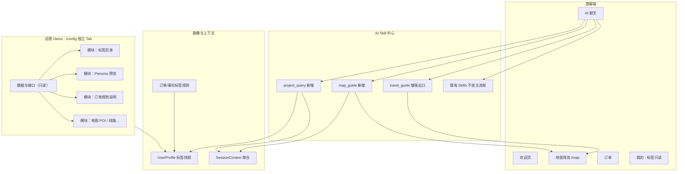
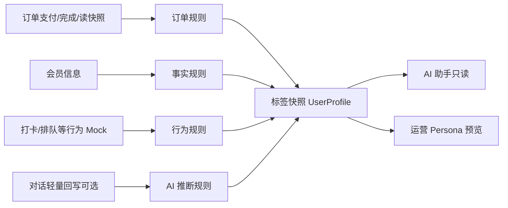

# AI 助手 × 地图导览 × 画像标签 — 细化方案

> **状态**：方案确认稿（先文档、后开发）  
> **日期**：2026-07-26  
> **前置讨论**：产品架构草案已确认决策（见下文「已拍板决策」）  
> **关联文档**：[`项目现状.md`](./项目现状.md)、[`场景实现对照表.md`](./场景实现对照表.md)、[`业务场景配置与实现.md`](./业务场景配置与实现.md)、[`对话意图识别与LLM分工.md`](./对话意图识别与LLM分工.md)

---

## 0. 已拍板决策

| # | 议题 | 结论 |
|---|------|------|
| 1 | 地图形态 | **形态 A**：景区自有导览地图（PNG + 地图服务 HTTP 包装），Demo 用 Mock 复刻能力边界，不接第三方地图 SDK |
| 2 | Skill 拆分 | **独立两个新 Skill**：`project_query`（项目查询）、`map_guide`（导览/地图动作） |
| 3 | 画像运营台深度 | Demo 做 **标签目录 + Persona 预览 + 订单规则说明**，不上完整 CDP；三者落在「数据与接口」Tab 内模块 |
| 4 | Mock 只读查看 | **独立 Tab** `/config/data`；页内 **每个模块独立 Title**；不支持改，兼作未来接口契约说明 |
| 5 | Phase 1 细节（2026-07-27 确认） | 见下表 |
| 6 | Phase 2 细节（2026-07-27 确认） | 见下表 |

### Phase 1 已确认细节（2026-07-27）

| # | 议题 | 结论 |
|---|------|------|
| P1-1 | MapAction 消息 | **新消息类型 `map_action`**（不复用 `page_guide`） |
| P1-2 | 底图 | **占位图 + `mapImageUrl` 可换真图**（先占位，不阻塞） |
| P1-3 | 演示景区 | **仅奇趣乐园 `scenic_hlg`** 做完整底图+POI；其他景区无地图 CTA / 空态 |
| P1-4 | 「导航过去」 | **Phase 1 不出**；未来若出现也只做**按钮+提示**，**不做**真实固定线路/导航演示（复杂度不值） |
| P1-5 | GuideCard「打开地图」 | Phase 1 曾 toast；**Phase 2 改为真跳 `/map?scenicId=`，不高亮项目** |
| P1-6 | 标签目录扩展 | **Phase 2 再做**；本阶段不改 `tags` / `family` 体系 |

### Phase 2 已确认细节（2026-07-27）

| # | 议题 | 结论 |
|---|------|------|
| P2-A1 | GuideCard「打开地图」 | **真跳转 `/map`**，**不高亮**攻略项目（避免演示挖坑） |
| P2-B1 | 标签兼容 | **`family` ↔ `order_family` 双写映射**，不打断 `member_offer` / 规则引擎 |
| P2-B2 | 订单规则 | 三套：`order_family` / `order_couple` / `order_group` |
| P2-B3 | AI 推断 | **目录 + Persona 预置 + 对话写回（演示）**：固定词「刺激 / 拍照|出片 / 休闲」→ `prefer_*`；正式版 LLM 归并同目录 |
| P2-B4 | travel_guide 选项目 | **吃标签**（亲子等影响挑选与 reason） |

### 交互补强（2026-07-27 追加）

| # | 议题 | 结论 |
|---|------|------|
| UX-1 | 美食 / 附近抢词 | 餐饮·零售意图优先 `proactive_marketing`，不进 `project_query` |
| UX-2 | 在园项目卡操作 | 演出：打卡·预约·地图；餐饮/零售：打卡·地图；游乐：排队·打卡·地图（同行） |
| UX-3 | 海洋明星卡 | 「详细介绍」+ 有答题时右侧答题；无答题通栏；详细介绍 toast 知识图详情 |
| UX-4 | 演出答题 | 有 `quizId` 的演出即可挂邀请（不限海豚名） |
| UX-5 | 数据 Tab | 园区项目露出 `quizId`；新增「海洋明星」模块 |
| UX-6 | 今日推荐路线 | 勿被 `project_query`「位置」误抢；须单条 GuideCard 攻略 |
| UX-7 | 场景关怀 | 在园≥4h 问附近项目 → 歇脚/冰淇淋温馨提示（核销时间或演示默认 10:00） |
| UX-8 | 菜系过滤 | 问中餐/西餐/小吃 → 餐饮推荐按 tags 过滤 |
| UX-9 | 附近项目合并 | 单条 `scene_recommend(nearby)`；关怀置顶冰淇淋；相对距离文案 |

> **对原方案 Phase 3 的修正**：原「固定游园线指引」演示降级——产品确认不做真实导航演示；能力②文档保留为真实落地说明，Demo 侧最多按钮提示。

---

## 1. 目标与边界

### 1.1 本阶段要验证什么

1. AI Skill 可调用「项目查询」与「导览」两类能力，且边界清晰。  
2. **项目实体**能串起：AI 回答 → 项目卡 → 地图打点/详情/排队 →（可选）固定线路指引。  
3. **用户画像标签**能影响推荐，且标签由规则中心产生、助手只读。  
4. **Session Context** 影响「附近 / 在园 / 导航」类结果。  
5. 运营侧能看懂标签从哪来、命中谁、订单规则怎么算。  
6. 线上可只读浏览 Mock，并对照未来落地接口契约（§15）。

### 1.2 明确不做（本阶段）

- 不接高德/腾讯等第三方 JS SDK。  
- 不做真实 GPS 连续定位与路径重算引擎（仅 Mock「在园 + 当前位置 + 固定线路」）。  
- 不做完整游客画像中心 CRUD / 人群圈选投放。  
- 不让 AI 对话实时生成全量标签（仅允许轻量交互回写少量 AI 推断标签，见 §5.4）。

---

## 2. 地图能力分层（对齐真实导览产品）

真实落地中，景区自有导览地图通常分三档能力。Demo **以①为必做，②为可演示增强，③标记为演进**。

### 2.1 能力① — 景区底图打点 + 项目详情（P0 必做）

**真实能力简述**

- 景区 PNG（或瓦片）+ 地图服务包装成 HTTP。  
- 在项目位置打点；点位使用**地图平面坐标**（相对底图，非 WGS84 亦可）。  
- 游客浏览地图时可：看到项目在景区哪、点开看详情、看当前排队。

**Demo 对应**

| 项 | 方案 |
|----|------|
| 底图 | 每景区一张静态 PNG（或占位图），挂在 `scenic` 或 `map` Mock |
| 坐标系 | `mapX` / `mapY`（相对底图 0–100 或像素坐标），**不叫 lat/lng**，避免与 GPS 混淆 |
| 打点 | `MapPOI` 绑定 `activityId`，地图页渲染 marker |
| 详情 | 点击 POI → 抽屉/半屏：名称、简介、标签、排队（复用 Activity 字段） |
| 入口 | AI 项目卡「查看位置」→ `/map?scenicId=&poiId=`；攻略卡「打开地图」→ 多点高亮 |



### 2.2 能力② — 在园 GPS + 固定游园线路指引（P1 Demo 增强）

**真实能力简述**

- 部分景区可配合「游客当前 GPS 是否在园」。  
- 指引到目标 POI 时，常见做法是：地图上画一条**固定游园线路**，再用当前位置与线路/节点坐标做匹配识别，而不是实时自由导航引擎。

**Demo 对应**

| 项 | 方案 |
|----|------|
| 在园判定 | 继续用 `visitorState.inPark`（Persona Mock）；可选开关「模拟 GPS 在园」 |
| 当前位置 | `currentLocation` 文案 + 映射到某个 `MapPOI` / 线路节点 `nodeId` |
| 固定线路 | `map/routes.json` 预置 1～N 条折线（节点序列），如「东门→漂流→萌宠→中心湖」 |
| 指引交互 | 「导航过去」→ 地图页：高亮**整条固定线路** + 标注「你在这」+「目标 POI」；文案说明「沿推荐游园线前往」 |
| 非在园 | 不画「从我这走」；仅展示目标打点 +「入园后可导航」 |



### 2.3 能力③ — 项目维护真实地理 POI（演进说明，本阶段不做）

**真实能力简述**

- 在项目上维护真实地理 POI（经纬度等），通常依赖地图服务商能力，是②的升级（可接步行导航、更准的距离与路网）。

**本阶段处理**

- 数据模型预留可选字段 `geoLat` / `geoLng`（可空），**Demo 不使用、不展示**。  
- 文档与后台文案标明：「真实 POI / 服务商路网 = 能力③，后续对接」。

### 2.4 三档对照小结

| 档位 | 坐标含义 | 游客感知 | Demo |
|------|----------|----------|------|
| ① 底图打点 | 地图平面坐标 | 在哪、详情、排队 | **P0** |
| ② 固定线路指引 | 平面坐标 + 在园位置节点 | 沿推荐线怎么走 | **P1** |
| ③ 真实地理 POI | WGS84 等 + 服务商 | 精细导航 | **仅预留字段** |

---

## 3. 产品架构（本迭代切片）



**原则（不变）**

- 助手只读：`UserProfile` + `SessionContext` + 业务实体。  
- 标签写入：订单/会员/行为规则（Mock）；AI 交互仅允许少量推断标签。  
- 地图不直接暴露给 LLM「乱调」：经 `map_guide` Skill / Tool 编排后出 **MapActionCard** 或跳转 `/map`。

---

## 4. 页面结构细化

### 4.1 游客端

| 页面 | 路径（建议） | 本迭代改动 |
|------|--------------|------------|
| 欢迎 / 聊天 | 现有 Chat | 快捷胶囊可加「附近好玩」「打开地图」；消息支持 MapAction |
| 地图导览 | **`/map` 新增** | 底图 + POI 打点 + 详情抽屉 +（P1）固定线路与当前位置 |
| 项目列表 | `/activity` | 项上增加「在地图中看」 |
| 订单 | `/orders` | 订单卡/列表展示 **本单订单标签**（只读） |
| 我的 | `/profile` | 「我的标签」只读列表（名称、类型、来源简述） |

#### 4.1.1 地图页信息架构

```
/map?scenicId=&poiId=&routeId=&fromNodeId=
├─ 顶栏：景区名 · 关闭/返回聊天
├─ 底图层：PNG
├─ 标注层：POI markers（选中态）
├─ 线路层（P1）：fixedRoute polyline + 当前位置点
└─ 底栏/抽屉：
     未选中 → 附近/推荐列表（可读 Session）
     选中 POI → 详情：图、名、标签、排队、适合人群、【加入路线】【回聊天】
```

### 4.2 运营端 Demo（配置后台）

| 入口 | 路径 | 能力 |
|------|------|------|
| 助手 UI | `/config/ui` | 现有，可改 |
| 业务场景 | `/config/business` | 现有 Skill / 推荐入口，可改 |
| **数据与接口** | **`/config/data`（独立 Tab）** | **只读**查看 Mock + 接口契约；见 **§15** |

标签目录 / Persona 预览 / 订单规则说明 **不单独再开 Tab**，作为「数据与接口」页内的独立模块（每个模块一个 Title），与地图、项目等模块并列展示。

不做：标签编辑发布流、人群包、自动运营任务；本 Tab **不支持改数据**。
---

## 5. 数据模型细化

### 5.1 Project（延续 `activities.json`，扩展字段）

| 字段 | 必填 | 说明 |
|------|------|------|
| 现有 activity 字段 | ✓ | id/name/category/location/tags/queue/… |
| `description` | 建议 | 详情文案 |
| `image` | 可选 | 详情头图 |
| `area` | 建议 | 与地图区域文案一致，如「极限区」 |
| `suitablePeople` | 建议 | `['亲子','成人']` |
| `excitementLevel` | 可选 | 1–5，服务刺激偏好 |
| `openingStatus` | 可选 | open / closed / maintenance |
| `mapPoiId` | **① 必填（有地图的项目）** | 关联 POI |
| `relatedGuideIds` | 可选 | 攻略模板 |
| `relatedProductIds` | 可选 | AI 商品 |
| `geoLat` / `geoLng` | 空 | **能力③预留，Demo 不用** |

### 5.2 MapPOI（新建 `src/mock/map/pois.json`）

```text
poiId          string
scenicId       string
activityId?    string     // 业务项目；设施点可空
name           string
mapX           number     // 平面坐标
mapY           number
area?          string
poiType        ride | show | dining | gate | facility | node
icon?          string
```

> 点位坐标 = **地图平面坐标**，与真实 GPS 分离。

### 5.3 MapRoute 固定游园线（新建 `src/mock/map/routes.json`，P1）

```text
routeId        string
scenicId       string
name           string        // 如「奇趣乐园经典游园线」
nodePoiIds     string[]      // 有序节点（引用 MapPOI）
polyline       { mapX, mapY }[]  // 绘制用；可与节点一致或更密
description?   string
```

**指引算法（Demo 级，写进实现说明即可）**

1. 将 `SessionContext.location` 映射到最近 `nodePoiId`（Mock 表或字符串匹配 `currentLocation`）。  
2. 目标 = 项目 `mapPoiId`。  
3. 若二者均在同一 `routeId` 的节点序列上：取子路径高亮；否则高亮整条默认线路 + 文案「请先回到主游园线」。  
4. 不在园：不计算子路径。

### 5.4 Scenic 地图配置（扩展景区 Mock）

```text
scenicId
mapImageUrl      // PNG
mapWidth / mapHeight 或 coordinateSpace: "percent" | "pixel"
defaultRouteId?  // P1 默认游园线
```

### 5.5 UserProfile / ProfileTag

```text
UserProfile {
  userId
  memberTags: ProfileTag[]
  orderTags: ProfileTag[]
  consumeTags: ProfileTag[]
  aiTags: ProfileTag[]
}

ProfileTag {
  tagId
  name
  category: fact | order | consume | ai
  source: member | order | consume | behavior | ai_chat
  createdAt
  confidence    // 事实/订单规则默认 1.0；AI 推断 < 1
  evidence?     // orderId / 规则 id / 简述
}
```

现有 `tags.json` 的 `new_guest` / `family` / `high_value` **并入目录**，并扩展订单类、AI 类（见 §7）。

### 5.6 SessionContext（聚合读模型，首版可不落独立 Store）

```text
visitStatus: off_park | in_park
location: { label, mapPoiId?, nodePoiId? }
time: ISO
intent?: string
activeSkillId?: string
currentOrder?: { orderId, status, visitDate, orderTagIds[] }
scenicId
```

来源映射：

| 字段 | 现有来源 |
|------|----------|
| visitStatus | `visitorState.inPark` |
| location.label | `visitorState.currentLocation` |
| currentOrder | 待出行/今日订单工具函数 |
| scenicId | `scenicStore` / conversation |
| intent / activeSkill | 路由结果临时写入 |

### 5.7 Guide 模板（可选增强，服务场景 1）

`src/mock/guides/templates.json`：主题攻略 + `relatedProjectIds` + 可选 `highlightRouteId`。  
运行时仍可走 `generateTravelGuide`，但输出带 `guideId` / `activityIds`，便于「打开地图」多点高亮。

### 5.8 AI 商品库字段（弱依赖，购票/会员用）

在现有 ticket / coupon_product 上增加可选：`targetUser`、`recommendScene`、`relatedProjectIds`。本迭代不强制改购票主流程。

---

## 6. Skill 能力列表（含两个新 Skill）

### 6.1 新增 `project_query` — 项目查询

| 项 | 内容 |
|----|------|
| **场景** | 查某个项目、附近好玩、带孩子玩什么项目、项目排队/是否开放 |
| **能力** | 检索 Project；按 Session 位置与 Profile 标签排序/过滤；输出 ActivityCard（含推荐原因、地图 CTA） |
| **所需数据** | Project、MapPOI（算「附近」按 area/节点邻接）、UserProfile、SessionContext |
| **不负责** | 画路线、打开地图页的导航语义（交给 `map_guide`）；不生成全日攻略长文（交给 `travel_guide`） |
| **触发示例** | 「过山车在哪里」「附近有什么好玩的」「萌宠乐园开放吗」「有什么适合小孩的项目」 |
| **Tools（建议）** | `getProjects`、`getNearbyProjects`、`getUserProfile`、`getSessionContext` |
| **Workflow** | 正则优先（与现网一致）；高置信可走 Skill→Workflow |

**与现有 Skill 边界**

| 易混 Skill | 区分 |
|------------|------|
| `travel_guide` | 攻略/怎么玩/交通入园/一日路线 → 仍归攻略；项目单点问答归 `project_query` |
| `scenic_recommend` | 演出场次/明星 → 保持；非演出「项目在哪」归 `project_query` |
| `queue_recommend` | 明确虚拟排队/取号 → 保持；「附近好玩」归 `project_query`（可附带排队信息） |

### 6.2 新增 `map_guide` — 导览 / 地图动作

| 项 | 内容 |
|----|------|
| **场景** | 打开地图、查看位置、导航过去、沿游园线怎么走 |
| **能力** | 解析目标 POI；组装 MapActionCard；跳转 `/map` 带 query；P1 绑定 fixedRoute |
| **所需数据** | MapPOI、MapRoute、SessionContext（在园/当前节点）、Project |
| **不负责** | 项目推荐排序与攻略文案；需要先选项目时可先调 `project_query` 或槽位澄清 |
| **触发示例** | 「打开地图」「导航去漂流」「怎么走到灯光秀」「在地图上看」 |
| **Tools（建议）** | `getMapPoi`、`planFixedRoute`（Mock）、`openMap`（返回 deepLink） |

**MapActionCard 建议字段**

```text
action: view_poi | navigate_fixed_route | open_map_overview
title
poiId?
activityId?
routeId?
fromNodeId?
deepLink   // /map?...
subtitle?  // 「沿经典游园线约 N 个节点」/「当前不在园，仅展示位置」
```

### 6.3 既有 Skill 联动（小改，不改主流程）

| Skill | 联动 |
|-------|------|
| `travel_guide` | GuideCard 增加「打开地图」→ 多 POI 高亮；亲子/刺激路线读 Profile |
| `order_query` | 展示订单标签；可引导「按该订单做攻略 / 打开地图预览」 |
| `queue_recommend` / `scenic_recommend` / `checkin_service` | Activity / 打卡结果可带「查看位置」→ `map_guide` deepLink |
| `ticket_purchase` / `member_offer` | 推荐理由可带标签名（可选） |

### 6.4 路由优先级（沿用现架构）

```text
Workflow 正则（含新 project_query / map_guide 意图）
  → Skill 关键词 / P0-2 语义路由
  → LLM + Tools
```

意图词需写入 `skill_intent_catalog` / 校验体系，避免与 `travel_guide` 抢「怎么玩」「路线」等词：  

- 「怎么玩 / 一日攻略 / 交通」→ `travel_guide`  
- 「XX 在哪 / 附近项目」→ `project_query`  
- 「打开地图 / 导航 / 怎么走过去」→ `map_guide`

---

## 7. 画像标签与订单规则（运营 Demo）

### 7.1 标签目录（示例，可落 `tags.json` 扩展）

#### 事实标签

| tagId | 名称 | 生成条件（Mock） |
|-------|------|------------------|
| `new_guest` | 新客 | 无 completed 订单（沿用现逻辑） |
| `member_gold` | 黄金会员 | `memberLevel` 含黄金 |
| `visit_repeat` | 多次入园 | completed 订单数 ≥ 2 |

#### 订单标签

| tagId | 名称 | 规则说明 |
|-------|------|----------|
| `order_family` | 亲子订单 | 任一相关订单 `quantity.child ≥ 1`，或票种 family_* |
| `order_couple` | 情侣出游 | 2 成人 0 儿童且非团队票（演示规则） |
| `order_group` | 团队游客 | 单笔 adult+child ≥ 5 |

#### 消费标签（可选，Demo 可少做）

| tagId | 名称 | 规则 |
|-------|------|------|
| `consume_high` | 高客单 | 历史实付合计超阈值（Mock） |

#### AI 推断标签

| tagId | 名称 | 规则 | confidence |
|-------|------|------|------------|
| `prefer_thrill` | 喜欢刺激 | 对话关键词「刺激」（演示）；正式版 LLM 归并「惊险」等 | 0.6–0.8 |
| `prefer_photo` | 偏好拍照 | 对话关键词「拍照/出片」（演示） | 0.6–0.8 |
| `prefer_slow` | 慢节奏 | 对话关键词「休闲」（演示） | 0.7 |

**兼容**：现有规则引擎用的 `family` / `high_value` 可与新 id 映射（`family` ↔ `order_family` 或保留双写一版），避免一次打断 `member_offer`。

### 7.2 标签产生时机（非助手实时打全量）



### 7.3 运营验收标准（落在「数据与接口」Tab 内模块）

1. **标签目录**模块：能按类型看清；每条有来源说明与默认置信度。  
2. **Persona 预览**模块：三个 demo 账号标签不同；能看到 evidence（如订单号）。  
3. **订单规则说明**模块：每条规则有「若/则」+ 至少一条 demo 订单命中/未命中示例。  
4. 以上均为 `/config/data` 页内独立 Title 区块，只读（详见 §15）。
### 7.4 推荐侧如何用标签（演示话术）

| 场景 | 读取 | 表现 |
|------|------|------|
| 「带孩子怎么玩」 | `order_family` / preferences | 亲子项目靠前；`reason` 文案带出标签 |
| 「附近好玩」 | Session 位置 + `prefer_thrill` 等 | 同区项目排序变化 |
| 会员选品 | 沿用 family/high_value 映射 | 不破坏现有 member_offer |

---

## 8. 核心用户流程（落地验收用）

### 场景 A — 游前攻略 + 打开地图（①）

1. demo_mid：「第一次来怎么玩 / 按订单做攻略」→ `travel_guide`。  
2. 出 GuideCard（项目序列）。  
3. 点「打开地图」→ `/map` 高亮相关 POI，可点开看详情与排队（排队在游前可弱化，与现 `guideContext` 一致）。

### 场景 B — 游中附近项目（① + Profile）

1. demo_vip（在园·漂流入口）：「附近有什么好玩的？」→ `project_query`。  
2. 按当前节点/区域过滤；亲子标签影响排序。  
3. ActivityCard：`【查看位置】` → map_guide / `/map?poiId=`。

### 场景 C — 项目问答 + 打点详情（①）

1. 「极限过山车在哪里？」→ `project_query` 介绍 + ActivityCard。  
2. 同条或下条 MapAction「查看位置」。  
3. 地图打点 + 抽屉详情含排队。

### 场景 D — 「导航」类（Demo 降级）

1. Phase 1：**不提供**「导航过去」入口。  
2. 未来若有按钮：仅 toast/文案提示，**不画路线**。

### 场景 E — 运营「数据与接口」Demo

1. 打开 `/config` → Tab「数据与接口」。  
2. 滚动/锚点到「标签目录」「Persona 预览」「订单规则说明」等模块 Title。  
3. 切换 Persona / 景区 → 预览与列表变化；各模块顶栏可见对应 `GET` 契约。
---

## 9. Mock 与接口清单

### 9.1 新增 / 扩展文件

| 路径 | 说明 |
|------|------|
| `src/mock/map/pois.json` | POI 平面坐标 |
| `src/mock/map/routes.json` | 固定游园线（P1） |
| `src/mock/guides/templates.json` | 可选攻略模板 |
| `src/mock/tags.json` | 扩展分类目录 |
| `src/mock/tags/rules.json` | 订单/事实规则说明与可执行条件 |
| `src/mock/users/demo_*.json` | 增加 `profileTags` 快照（或运行时由规则生成） |
| `src/mock/activities.json` | 扩展 Project 字段 + `mapPoiId` |
| `src/mock/scenic/list.json` | `mapImageUrl` 等 |
| `src/mock/assistant/skills.json` | 注册两 Skill |
| `src/mock/assistant/skill_intent_catalog.json` | 子意图词 |
| `src/mock/assistant/api_catalog.json`（可选） | 数据 Tab：模块 Title ↔ API path ↔ 落地注解 |

### 9.2 Mock API（建议）

| API | 用途 |
|-----|------|
| `GET /api/map/config?scenicId=` | 底图与坐标系 |
| `GET /api/map/pois?scenicId=` | POI 列表 |
| `GET /api/map/routes?scenicId=` | 固定线路 |
| `GET /api/map/plan?scenicId=&fromNodeId=&toPoiId=` | Mock 子路径 |
| `GET /api/member/profile-tags` | 分层标签（可替代/增强现 tags） |
| `GET /api/admin/tag-catalog` | 运营目录 |
| `GET /api/admin/tag-rules` | 规则说明 |
| `GET /api/admin/persona-preview?personaId=` | 预览聚合 |
| `GET /api/session/context`（可选） | Session 只读；可内嵌在 persona-preview |

以上 API 均应能在 **§15 数据与接口 Tab** 对应模块中只读查看。  
可选：`src/mock/assistant/api_catalog.json` 描述模块 Title ↔ path ↔ 落地注解，供 Tab 渲染。

聊天侧 Tool 走现有 handlers 风格即可。

### 9.3 前端消息类型

- 新增 `map_action`（推荐），或暂用 `page_guide` 承载 deepLink（权衡：独立类型更利于演示「地图动作卡」）。  
- `ActivityCard` 增加可选 CTA：`mapActions?: { label, path }[]`。

---

## 10. 分期实施（仍先不写代码，仅排期）

> **关于「Mock 在后台可见」落在哪**：它不是「等新数据建完才做」的附属项。  
> - **可最早交付**：用**现有** `GET /api/activities` 等即可挂 Tab（见下方 **Phase 0**）。  
> - **随域补模块**：新 Mock（地图 POI、画像规则等）在对应 Phase 建好后，往同一 Tab **加 Title 模块**即可。  
> - Phase 1 主体仍是「新数据 + 地图① + 两 Skill」；数据 Tab 壳若 Phase 0 已做，Phase 1 只需挂上地图相关模块。

### Phase 0 — 数据与接口 Tab（建议最先做，可与造数并行）

**目标**：线上立刻能看 Mock、能讲接口；**不依赖**本迭代新建的 POI/画像数据。

1. `/config` 增加独立 Tab「数据与接口」→ `/config/data`。  
2. 顶栏：`scenicId` / `personaId` 筛选。  
3. 页内按模块独立 Title，先挂**现有**能力，例如：  
   - 园区项目 · `GET /api/activities`  
   - 票商品 / 券商品 · 现有 products API  
   - 内容块 · `GET /api/content/blocks`  
   - 用户快照·订单（按 persona）  
   - 标签（简版）· `/api/tags`、`/api/member/tags`（Phase 2 已由「标签目录 / 会员分层标签」增强）  
   - 规则字段目录 · `GET /api/admin/field-catalog`  
   - Skill 配置（只读）· `GET /api/assistant/skills`  
4. 每模块：契约条 + 落地注解 + 表格 + JSON 折叠；**无编辑**。  

**验收**：打开 Tab 能看到至少「园区项目」等现网 Mock；切换景区/Persona 有变化。

---

### Phase 1 — 新 Mock 数据 + 地图① + 两 Skill（游客侧主链路）

**目标**：游客侧能「问项目 → 看卡 → 打开地图打点/详情/排队」（演示景区：`scenic_hlg`）。

**已确认边界**：见 §0「Phase 1 已确认细节」。

1. **造数**：`scenic_hlg` 底图配置（占位 `mapImageUrl`）+ POI（`mapX/mapY` 百分比）+ Activity.`mapPoiId`。  
2. 页面：`/map` 打点 + 详情抽屉（名称/简介/标签/排队）；**无**导航路线层。  
3. Skill：`project_query`、`map_guide`（仅 `view_poi` / `open_map`）。  
4. 新消息类型 `map_action`；ActivityCard 在有 `mapPoiId` 且当前景区有地图配置时出「查看位置」。  
5. GuideCard「打开地图」：**toast「跳转到地图查看」**（本阶段不跳转、不多点高亮）。  
6. SessionContext 聚合函数（只读）。  
7. **回写数据 Tab**：模块「地图配置」「地图 POI」。  
8. **不做**：标签扩展、「导航过去」、固定游园线、多景区完整地图。

---

### Phase 2 — 画像运营 + 推荐吃标签 + 数据 Tab 画像模块（已完成）

**已确认边界**：见 §0「Phase 2 已确认细节」。

1. GuideCard「打开地图」真跳 `/map?scenicId=`（不高亮项目）。  
2. 标签目录扩展（事实 / 订单 / AI 推断）+ `family`↔`order_family` 双写。  
3. 订单规则引擎三套：`order_family` / `order_couple` / `order_group`。  
4. AI 推断：目录 + Persona 预置，无对话回写。  
5. `/config/data` 补模块：标签目录 / Persona 预览 / 订单规则说明 / 会员分层标签。  
6. `travel_guide`（及项目查询）选项目吃标签并透出 reason。  
7. Profile / Orders 只读展示标签。

---

### Phase 3 — 地图能力说明（Demo 降级）（已完成）

> **产品确认（2026-07-27）**：不做真实固定线路/导航演示。  
> UI「导航过去」仅 **toast**（「请使用景区导览 App 导航」），不画路线、不算子路径。  
> `/config/data` 已挂「固定游园线」「线路规划（Mock）」**契约占位**模块。

原规划（真实落地参考，Demo 不实现）：

1. `routes.json` + 在园 GPS + 固定游园线匹配。  
2. 线路规划返回真实子路径节点。

---

### Phase 4 — 预留

- `geoLat/geoLng` 与服务商对接说明。  
- AI 交互回写推断标签。  
- Guide 模板实体化加强。

### 分期对照（后台可见 vs 造数）

| 能力 | 环节 | 是否要先造新 Mock |
|------|------|-------------------|
| 数据 Tab 壳 + 现有模块可见 | **Phase 0** | 否 |
| 地图 POI 等模块出现在 Tab | Phase 1 末 | 是（随 Phase 1 造数） |
| 标签目录 / Persona / 订单规则模块 | **Phase 2** | 是（规则与分层标签） |
| 游园线 / plan 模块 | **Phase 3**（契约占位已挂；真实演示不做） | 否（占位响应即可） |

---

## 11. 与现网能力映射（避免重复建设）

| 现有 | 本方案复用方式 |
|------|----------------|
| `activities.json` + ActivityCard | 升级为 Project 枢纽；加地图 CTA |
| `travel_guide` / GuideCard | 增加打开地图；不拆掉攻略 Skill |
| `visitorState.inPark` / `currentLocation` | 纳入 SessionContext；映射节点 |
| `tags.json` + ruleEngine + member_offer | 目录扩展；映射兼容；运营预览 |
| `/config` 路由壳（ui / business） | 增独立 Tab「数据与接口」`/config/data` |
| 已有 `GET /api/activities` 等 Mock HTTP | 数据 Tab 优先走 API，不直读 JSON |
| `page_guide` 深链模式 | MapAction 可同源设计 |
| 打卡 spots `location` 字符串 | 逐步挂 `mapPoiId` |
| 无地图 SDK | 坚持形态 A，自有底图 Mock |

---

## 12. 风险与注意点

1. **意图抢词**：`travel_guide` vs `project_query` vs `map_guide` 必须在 catalog 与正则层划清（§6.4）。  
2. **坐标语义**：文档与代码注释统一用 `mapX/mapY`，避免与 GPS 混用。  
3. **排队数据**：地图详情与聊天卡同一数据源，避免两套 Mock。  
4. **Persona 切换**：预览与游客端标签一致，均走同一规则函数。  
5. **多景区**：POI/底图/线路均带 `scenicId`；无底图景区可隐藏地图 CTA。  
6. **数据 Tab 只读**：避免与 `/config/business` 的 LocalStorage 覆盖逻辑混用，防止演示时「改了配置却以为改了主数据」。

---

## 13. 确认清单（开发前）

- [x] 地图形态 A；①必做；②真实落地说明保留、Demo 不做导航演示；③预留  
- [x] 独立 Skill：`project_query`、`map_guide`  
- [x] 运营 Demo：目录 + Persona 预览 + 订单规则说明（落在数据 Tab 模块内）  
- [x] Mock 只读查看：独立 Tab「数据与接口」`/config/data`；每模块独立 Title  
- [x] MapAction：**新类型 `map_action`**  
- [x] 底图：占位 + 可换真图；演示景区仅 `scenic_hlg`  
- [x] 「导航过去」：不出真实效果；未来仅按钮提示  
- [x] GuideCard 打开地图：真跳 `/map`、不高亮（Phase 2）  
- [x] 标签扩展 Phase 2：双写映射 + 三套订单规则 + AI 目录预置 + travel_guide 吃标签  
- [x] `family` 与 `order_family` 兼容策略：**双写映射**  
- [x] Phase 3：「导航过去」仅 toast；数据 Tab 线路契约占位；无真实画线/规划  
- [x] 美食路由：餐饮意图优先营销，不被「附近推荐」抢成游乐项目  
- [x] 在园项目卡同行操作（排队/打卡/预约/地图）；明星卡详细介绍 + 答题  
- [x] 数据 Tab：`quizId` + 海洋明星；演出答题按 `quizId` 匹配  
- [x] 对话写入 AI 刺激标签：**演示版已做**固定词「刺激 / 拍照|出片 / 休闲」→ 封闭目录写回；正式版改为 LLM 映射同一目录  

---

## 14. 下一步

方案按本文冻结后，开发顺序建议：

**Phase 0～3（已完成，Phase 3 为 Demo 降级）→ Phase 4 预留**：`geoLat/geoLng` 对接说明、AI 对话回写推断标签、Guide 模板实体化加强。

本文方案正文可随实现微调；**各阶段边界以 §0 确认表为准**。

---

## 15. 数据与接口 Tab（Mock 只读浏览器）

> **目的**：线上直接查看 Mock 数据（不支持改），演示直观，并为未来落地明确接口契约。  
> **入口**：`/config` 下与「助手 UI」「业务场景」并列的 **独立 Tab**，路由建议 `/config/data`。

### 15.1 定位与边界

| 项 | 说明 |
|----|------|
| 能做什么 | 按模块浏览 Mock 返回内容；看清 `METHOD path`、筛选参数、字段含义、落地对接说明 |
| 不能做什么 | 编辑、保存、上传、LocalStorage 覆盖主数据 |
| 与业务场景 Tab | Skill / 推荐入口仍在 `/config/business`（可改）；本 Tab 只读展示 Skill 配置副本亦可 |
| 与游客端 | 同一套 Mock API；切换景区 / Persona 后与聊天侧数据一致 |

### 15.2 页面信息架构

```
/config
├─ Tab：助手 UI
├─ Tab：业务场景
└─ Tab：数据与接口          ← 本能力
     /config/data
     ├─ 顶栏筛选：scenicId · personaId（影响依赖用户/景区的模块）
     ├─ （可选）页内锚点导航：跳到各模块 Title
     └─ 纵向模块列表（每个模块独立 Title，互不嵌套成子 Tab）
```

**展示原则**：每个模块一块独立区域，结构统一：

```text
## {模块 Title}
契约条：GET /api/... ?scenicId= & persona 相关说明
落地注解：未来对接系统一句话
[ 人读表格 / 卡片 ]
[ 折叠：原始 JSON ]
```

### 15.3 模块清单（每个 Title 一块）

按页内从上到下建议顺序；可随 Phase 增减，但 **Title 保持独立、不合并成一个大表**。  
**挂载时机**：见 §10「分期对照」——现有模块归 **Phase 0**；地图 POI 归 Phase 1；画像三模块归 Phase 2；线路归 Phase 3。

#### 已有数据（Phase 0 即可挂，不依赖新造数）

| 模块 Title | 主要契约 | 展示要点 |
|------------|----------|----------|
| **景区与城市** | 景区/城市列表 API（现有或补统一 GET） | scenicId、名称、是否启用、底图字段（有则显示） |
| **园区项目** | `GET /api/activities` | activityId、名称、区域、排队、`mapPoiId`、`quizId`（有则显示） |
| **海洋明星** | `GET /api/stars` | starId、名称、物种、`quizId`、别名；按景区过滤 |
| **票商品** | `GET /api/products/tickets` 等 | 票种、标签、价格、scenicId |
| **券商品** | `GET /api/products/coupons` | 券产品、用途 |
| **内容块** | `GET /api/content/blocks` | traffic / entry / guide 等 |
| **用户快照 · 订单** | 订单列表类 API（按 persona） | 订单字段 +（有规则后）本单标签 |
| **标签（兼容）** | `GET /api/tags`、`GET /api/member/tags` | 扁平兼容；运营查看请用下方「标签目录 / 会员分层标签」 |
| **规则字段目录** | `GET /api/admin/field-catalog` | 推荐入口规则可用字段 |
| **Skill 配置（只读）** | `GET /api/assistant/skills` | skillId、名称、tools；注明编辑请去业务场景 Tab |
| **打卡点 / 虚拟排队** | 现有 checkin / virtual-queue API | 与游中能力对照 |

#### 方案新增（随地图 / 画像 Phase 挂上）

| 模块 Title | 主要契约 | 展示要点 |
|------------|----------|----------|
| **地图配置** | `GET /api/map/config?scenicId=` | 底图 URL、坐标系（mapX/mapY）、默认线路 |
| **地图 POI** | `GET /api/map/pois?scenicId=` | 平面坐标、绑定 activityId、poiType |
| **固定游园线** | `GET /api/map/routes?scenicId=` | 节点序列、能力②说明 |
| **线路规划（Mock）** | `GET /api/map/plan?...` | 选 from/to 看返回子路径（只读试算） |
| **标签目录** | `GET /api/admin/tag-catalog` | 事实 / 订单 / AI 分类；来源与默认置信度 |
| **Persona 预览** | `GET /api/admin/persona-preview?personaId=` | 画像分层标签、Session 摘要、evidence |
| **订单规则说明** | `GET /api/admin/tag-rules` | 若/则 + demo 订单命中表 |
| **会员分层标签** | `GET /api/member/profile-tags` | 与助手只读画像一致 |
| **Session 上下文** | 预览内嵌或 `GET /api/session/context` | 与 UserProfile 分开展示 |
| **攻略模板** | `GET /api/guides/templates?scenicId=` | relatedProjectIds、可选线路 |

> 细化方案原「运营三页」= 上表中 **标签目录 / Persona 预览 / 订单规则说明** 三个模块 Title，不再单独开 Tab。

### 15.4 交互细则

1. **顶栏筛选**：`scenicId`、`personaId` 变化后，依赖它们的模块重新请求；不依赖的模块可不动。  
2. **契约条固定样式**：每个模块 Title 下第一行展示完整 path；复制按钮可选。  
3. **落地注解**：如「地图 POI → 景区导览中台；profile-tags → 会员/标签中心」。地图模块标注能力①②③。  
4. **关联提示（可选）**：项目行若有 `mapPoiId`，文案提示「见模块：地图 POI」；不做强制跳转亦可。  
5. **原始 JSON**：默认折叠，便于对接同事核对字段。  
6. **明确无写操作**：无保存按钮；与 business Tab 的「保存到本机」隔离。

### 15.5 技术约定（实现时）

```text
/config/data 页面
  → 仅调用 GET api/*
  → mock HTTP 注册（与游客端同源）
  → src/mock/**/*.json
```

- 页面 **优先经 API 拉数**，避免直接 import JSON，保证「线上看到的 = 契约返回的」。  
- 可用轻量 `api_catalog.json`（或写死模块配置）驱动模块 Title、path、落地说明文案。  
- 鉴权与现 `/config` 一致（演示版 public）。

### 15.6 验收标准

1. `/config` 可见独立 Tab「数据与接口」，进入后为单页多模块，**每个模块有独立 Title**。  
2. 至少 1 个已有模块（如园区项目）展示表格 + 契约条 + JSON 折叠。  
3. 切换景区 / Persona 后，相关模块数据变化且与游客端 Mock 一致。  
4. 全 Tab 无编辑/保存入口。  
5. 画像三模块挂上后，场景 E 可完整串讲。

### 15.7 演示话术（30 秒）

1. 打开「数据与接口」→ 指着「园区项目」Title 与 `GET /api/activities`。  
2. 滚到「地图 POI」→ 说明落地接导览服务同一类接口。  
3. 切 Persona →「Persona 预览」标签变化 → 说明助手只读、规则在订单/会员侧。  
4. 回到聊天：同一数据驱动卡片与地图。
