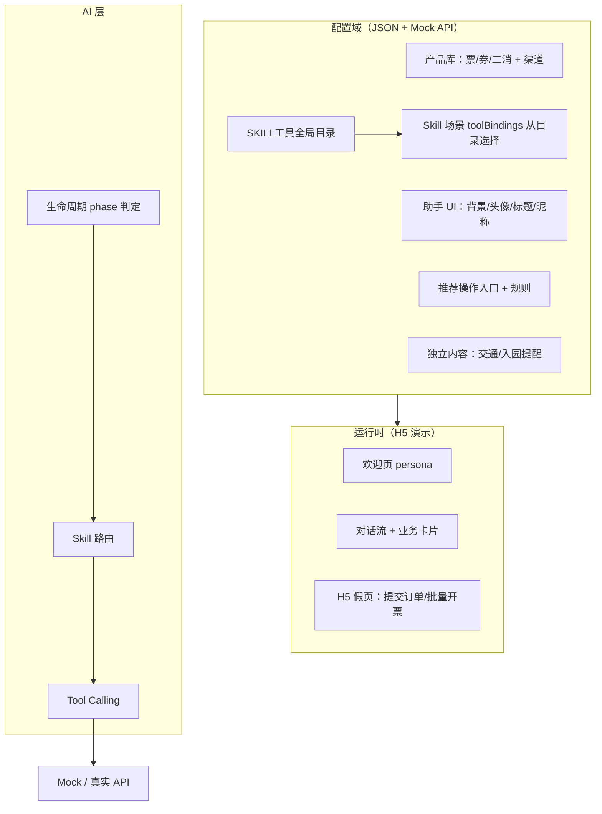

# AI 景区智能聊天助手（演示版）落地计划

> **文档角色**：**目标 / 已拍板决策 / 架构与分期意图**（规划底稿）  
> **版本**：v0.7.6  
> **更新日期**：2026-07-29  
> **依据**：早期 Word PRD（业务能力与演示重点）；本文件为落地决策 / 架构底稿。进度以 [`项目现状.md`](./项目现状.md) 为准。

### 阅读指引（进度不在此维护）

| 需求 | 请看 |
|------|------|
| **当前已完成 / 待办 / P3** | [`项目现状.md`](./项目现状.md) |
| **游前中后场景 × Skill 对照** | [`场景实现对照表.md`](./场景实现对照表.md) |
| **配置与购票/推券规格** | [`业务场景配置与实现.md`](./业务场景配置与实现.md) |
| **Workflow vs LLM** | [`对话意图识别与LLM分工.md`](./对话意图识别与LLM分工.md) |
| **演示串讲** | [`项目现状.md`](./项目现状.md) 演示矩阵 |

下文中的 ✅/❌ 勾选与「进度快照」仅为**分期意图与历史记录**，可能滞后；**以实现代码 + 项目现状为准**，勿在本文重复改状态。

### 实施进度图例（仅用于文内历史勾选）

| 标记 | 含义 |
|------|------|
| ✅ | 规划项已落地（以项目现状为准） |
| 🚧 | 部分实现 |
| ❌ | 未做（本期或 P3 预留） |
| 📝 | 仅有 Mock/JSON，未接对话或页面 |

### 范围快照（意图摘要，非实时进度）

| 域 | 规划意图 |
|----|----------|
| 游前 P1 | 购票闭环、攻略、订单、领券、会员选品、Admin |
| 游中 P1/P2 | 排队、打卡、演出、餐零售、答题；`route_plan` 串联仍为后续 |
| 游后 P1 | 开票、停车、点评 |
| P3 预留 | H2 主动气泡、地理围栏/离园推券、离园推送、OCR 对话 |
| 明确不做 | 失物招领、快递周边发券、知识图谱/抽奖 |

---

## 一、项目概述

### 1.1 目标

构建基于 LLM + Tool Calling 的「景区智能聊天助手演示系统」，覆盖 **游前 / 游中 / 游后** 全生命周期，模拟真实景区 AI 助手能力，用于项目演示、客户售前、AI 能力验证及后续产品孵化。

### 1.2 定位

不是普通聊天机器人，而是 **「AI 智慧景区运营入口」**——AI 负责意图识别、业务能力调用、推荐营销、用户状态分析与场景化服务；**具体沟通过程统一为对话样式**，重操作（下单、支付、批量开票）通过 **H5 假页 / 小程序页跳转** 完成。

### 1.3 演示版约束

| 项 | 决策 |
|---|---|
| 业务后台 | 不接真实业务后台；数据 **独立 JSON 管理** + vite-plugin-mock |
| 配置后台 | **简易 Admin** ✅ `/config/ui` + `/config/business`（LocalStorage 覆盖 JSON；旧 `/admin/*` redirect）；产品库仍 JSON 源 |
| 终端形态 | 移动端 H5（Vant 4）；跳转契约按 **小程序语义** 文档化 |
| 用户体系 | 强制微信 Mock 登录；3 演示账号 |
| LLM | DeepSeek V4 Flash，独立配置文件 |
| OTA/TA 订单 | **只读展示**（Q1） |

---

## 二、已确认决策清单

| # | 议题 | 确认结论 | 状态 |
|---|------|----------|------|
| 1–17 | 见 v0.5 | LLM、Mock、登录、价目、停车、CFG 等 | ✅ |
| 18 | OTA/TA 订单 | **先只读**展示，不支持对话改签/退票（Q1） | ✅ |
| 19 | 下单跳转 | **H5 假页**模拟提交订单；文档注明 **小程序契约**（Q2） | ✅ |
| 20 | 用户标签 | 先做 3 个：`新客` / `亲子` / `高价值`（Q3） | ✅ |
| 21 | 虚拟排队 Mock | **2 个项目**处于排队中（Q4） | ✅ |
| 22 | 游中互动 | **1 个答题 Demo**（Q5） | ✅ |
| 23 | 批量开票 | 对话 **入口跳转** 至开票页（假页示意）（Q6） | ✅ |
| 24 | 配置管理 | **JSON 源 + 简易 Admin**（Q7 演示版已扩展业务场景页） | ✅ |

---

## 三、架构总览

### 3.1 分层



### 3.2 技术栈

```
前端：Vue 3 + Vite + TypeScript + Pinia + Vue Router + Vant 4
Mock：vite-plugin-mock（配置与业务均走 /api/*）
AI：  DeepSeek / 硅基流动兼容 + Tool Calling + Skill / Workflow
存储：LocalStorage（按 userId 隔离；Admin 覆盖同）
配置：独立 JSON 域 + 简易 Admin（/config）
```

### 3.3 LLM / 登录 / Mock

同 v0.5：DeepSeek V4 Flash、`llm.ts` 唯一入口、强制微信 Mock 登录、三演示账号、`vite-plugin-mock` 后期可换真实 API。

---

## 四、配置域模型（独立 JSON 管理）

> 配置以 **独立 JSON + Mock API** 为源；演示版另有 **简易 Admin**（`/config`：助手 UI + 业务场景，LocalStorage 覆盖）。结构与产品化运营后台对齐，便于后续替换数据源。

### 4.1 产品库 — 票 / 券 / 二消，区分渠道

> **运营后台「产品管理」（HTML 原型已定稿口径）**：维护 AI **可售/可推清单**，**必须**经供应商「来源 + 对接产品 ID」精确查询绑定，**不允许纯手工建档**（否则无法下单）。一期类型：**门票 / 卡票 / 组合产品**（餐饮、零售需门店筛选后续再开）。列表在产品类型右侧含**游玩期限 / 可售期限 / 是否自销可售**，另有对接状态、参考售价、标签等；对接摘要含期限字段（游玩/可售/提前售卖）与是否自销可售。详情见 [`prototypes/README.md`](./prototypes/README.md)。券模板仍在「券管理」。  
> 下文 `channels: self|ota|ta` 与 Mock JSON 描述的是**演示数据源 / 销售渠道**；与后台「来源=对接供应商」不是同一字段。与「是否自销可售」（对接回写：是否含自销小程序）相关但展示字段不同。

#### 渠道定义

```typescript
type SalesChannel = 'self' | 'ota' | 'ta'  // 自销 / OTA / TA（演示购票过滤）
type AiProductType = 'ticket' | 'pass' | 'bundle'  // 一期后台合列表；dining/store/queue 预留
```

#### 产品基础结构

```typescript
interface ProductBase {
  productId: string              // 演示 Mock ID；正式可与 externalProductId 并存
  externalProductId?: string     // 对接产品 ID（后台绑定主键之一）
  supplierId?: string            // 来源：对接供应商/系统
  name: string
  type: 'ticket' | 'pass' | 'bundle' | 'coupon_product' | 'retail' | 'dining' | 'show'
  channels: SalesChannel[]       // 销售渠道（演示）；非后台「来源」下拉
  status: 'on' | 'off'           // AI 清单上下架（列表开关）
  syncStatus?: string            // 对接状态（如正常/停用）
  refPrice?: number              // 参考售价（非日历实价）
  tags?: string[]                // 标签管理多选，用于推荐（替代独立「票种类型」运营字段）
}

interface TicketProduct extends ProductBase {
  type: 'ticket'
  ticketKind?: 'calendar' | 'period'  // 门票类型：日历票 / 期票（对接回写）
  /** 游玩期限：有效开始 ~ 有效结束（后台摘要/列表合并展示） */
  validStart?: string
  validEnd?: string
  /** 可售期限：售卖开始 ~ 售卖结束 */
  saleStart?: string
  saleEnd?: string
  /** 提前售卖期限：最小 / 最大预订天数 */
  bookMinDays?: number
  bookMaxDays?: number
  /** 是否自销可售（是否含自销小程序渠道） */
  selfChannelSaleable?: boolean
  composition?: { adult: number; child: number }
}
```

#### 后台列表（JSON 文件）

| 列表 | 文件建议 | 说明 |
|------|----------|------|
| 票产品 | `mock/products/tickets.json` | 演示票数据；正式以对接绑定清单为准 |
| 券产品（模板） | `mock/products/coupon_products.json` | 可领取的券模板（「券管理」） |
| 二消/商餐/演出 | `mock/products/retail.json` | 门店、套餐等；餐饮进 AI 产品管理需门店筛选，非一期 |

**自销 vs OTA/TA 区分**：列表 API 支持 `?channel=self|ota|ta` 筛选；对话购票 **仅引导自销渠道** 下单，OTA/TA 订单 **只读** 展示来源。

#### 账户券 vs 券产品

| 概念 | 存储 | 用途 |
|------|------|------|
| 券产品 | `coupon_products.json` | 运营配置的可领券 |
| 账户券 | 用户快照 `coupons[]` | 已发到小程序账号的券 |

---

### 4.2 助手 UI 配置（扩展 CFG-1）

| 字段 | 说明 | 展示位置 |
|------|------|----------|
| `chatBackgroundUrl` | 聊天框背景图 | `/chat` 全屏背景 |
| `assistantAvatarUrl` | 助手头像 | 顶部头像、静态头像 |
| `dialogTitle` | 对话框标题 | NavBar 标题 |
| `assistantName` | 助手名称 | 配置/关于 |
| `assistantNickname` | 助手昵称 | 对话自称、欢迎文案 |
| `defaultImageUrl` | 助手默认图 | 欢迎页无对话记录时 |
| `greeting` | 通用欢迎语兜底 | 无 persona 模板时 |
| `primaryColor` / `primaryColorLight` / `primaryColorDark` | 主题强调色 | 按钮、强调色 |
| `motions[]` | 6 种形态 | idle/thinking/nod/shake/wave/point |

**文件**：`mock/assistant/ui_config.json`（可与原 `config.json` 合并）

---

### 4.3 Skill 场景配置（扩展 CFG-2）

```typescript
type VisitorPhase = 'pre' | 'in_park' | 'post_same_day' | 'post_later'

interface AssistantSkillConfig {
  skillId: string
  name: string
  description: string
  phase: VisitorPhase | VisitorPhase[]
  enabled: boolean
  trigger: {
    keywords?: string[]
    rules?: RuleExpression[]    // 见 §4.5
  }
  tools: string[]               // 运行时 Tool 白名单（可由 toolBindings 推导）
  /** 运维后台编辑态：从「SKILL工具」目录选择；合并原 tools 与 apiBindings */
  toolBindings?: {
    name: string                // 必须 ∈ 全局工具目录，如 getProductCatalog
    access: 'read' | 'write'    // 不得宽于目录该项默认
  }[]                           // 最多 20 项
  promptAddon: string
  linkedMotions?: {
    onStart?: AssistantMotionId
    onSuccess?: AssistantMotionId
    onFail?: AssistantMotionId
  }
}
```

**文件**：`mock/assistant/skills.json`

**Skill 与 Tool 关系**：Skill = 场景编排；Tool = 原子能力。

- **运维管理 → SKILL工具**：维护**全局工具目录**（能力标识 + 名称 + 默认只读/写入，最多 **20**）；不可在 Skill 抽屉手填发明标识。
- **运维管理 → Skill 场景 → 绑定工具**：从目录**下拉选择**添加（最多 **20** 组；读写不得宽于目录默认）。
- **子意图**内嵌于 Skill **新增/编辑**抽屉（**0～10，可选**）：每子意图含**默认关键字** + 多工具（须 ∈ Skill 工具池；读写不得宽于 Skill）。无子意图时默认关键字挂 Skill；有子意图时 Skill 为合集只读。**0→1 子意图按方案 B 同页自动迁入默认词**。演示数据建议同时覆盖「有子意图 / 无子意图」两种形态。

**后台编辑边界**：运营侧维护 **补充关键字** `customKeywords`（与默认同级挂载；默认/工具/指令只读；**无启停**，状态只读展示）；运维侧维护工具目录、`enabled`、`skillId`（**仅新增可写**）、`toolBindings`（选自目录）/ 子意图（含默认关键字）/ `promptAddon` / 无子意图时的 `defaultKeywords`，并只读可见补充关键字。列表操作：运营 **编辑关键字**、日志；运维 **编辑**、日志（无独立「子意图配置」）。环境级外部接口在 **外部接口对接**（原「接口配置」拆分）。

**建议记入操作日志的动作**：SKILL工具目录增删改；Skill 新增/编辑/状态开关（运维）；子意图增删改；默认与补充关键字迁移（0→1 / N→0）；Skill / 子意图工具绑定变更；运营补充关键字增删；外部接口对接变更。

---

### 4.4 推荐操作入口（配合场景）

与 Skill **解耦**：Skill 管 AI 对话逻辑；**入口**管页面上固定露出的快捷操作。

```typescript
interface RecommendEntry {
  entryId: string
  title: string
  icon: string
  target: 'chat' | 'page' | 'h5' | 'mini_program'
  targetPath?: string
  skillId?: string              // 点击后带入对话上下文
  rules: RuleExpression[]
  priority: number
}
```

**典型规则示例**：

| 条件 | 入口 | 账号 |
|------|------|------|
| `hasPendingVisitOrder`（`visitDate >= 今天`） | 交通指南、查看订单 | demo_mid |
| `hasPendingVisitOrder` | 停车缴费 | 三演示账号 |
| `inPark === true` | 今日路线 | demo_vip |
| `hasInvoiceableOrders` | 开发票（对话引导） | demo_vip |
| `persona === demo_new` | 首次购票指引 | demo_new |

**文件**：`mock/assistant/recommend_entries.json`

---

### 4.5 独立内容配置

```typescript
interface ContentBlock {
  contentId: string
  type: 'traffic' | 'entry_notice' | 'faq' | 'guide' | 'strategy'
  title: string
  body: string                  // 或 richText
  media?: string[]
  validFrom?: string
  validTo?: string
}
```

**用途**：交通信息、入园提醒、游玩攻略素材、Skill 引用片段。

**文件**：`mock/content/blocks.json`

---

### 4.6 规则表达式（RecommendEntry / Skill 共用）

```typescript
type RuleExpression =
  | { op: 'eq'; field: string; value: unknown }
  | { op: 'in'; field: string; values: unknown[] }
  | { op: 'and' | 'or'; rules: RuleExpression[] }

// 常用 field 示例
// personaId, memberLevel, inPark, visitorPhase
// hasPendingVisitOrder（paid/pending 且 visitDate >= 今天）
// nextVisitDate, upcomingVisitOrderCount, hasVisitToday
// hasInvoiceableOrders
// tags[] 包含 新客/亲子/高价值
```

---

### 4.7 配置 JSON 目录（v0.6）

```
src/mock/
├── products/
│   ├── tickets.json
│   ├── coupon_products.json
│   └── retail.json
├── assistant/
│   ├── ui_config.json
│   ├── skills.json
│   ├── recommend_entries.json
│   └── welcome_templates.json    # 三 persona 欢迎页
├── content/
│   └── blocks.json
├── users/
│   ├── demo_new.json
│   ├── demo_mid.json
│   └── demo_vip.json
├── tags.json                     # 新客/亲子/高价值
├── virtual_queue.json            # 2 个项目排队中
├── quiz.json                     # 海洋公园 3 套答题（海豚/企鹅/白鲸）
└── stars.json                    # 企鹅、白鲸明星介绍
```

---

## 五、用户生命周期与数据底座

### 5.1 前置条件（授权登录后）

登录后可查询（Tool / API）：

| 能力 | API / Tool | 演示版 |
|------|------------|--------|
| 会员等级 / 积分 / 余额 | `getMemberInfo` | ✅ |
| 产品订单（含第三方） | `getOrders` | ✅ 订单带 `source: self\|ota\|ta` |
| 券列表（账户券） | `getCoupons` | ✅ |
| 虚拟排队订单 | `getVirtualQueueOrders` | ✅ 2 条 Mock |
| 游客列表 | `commonVisitors` | ✅ |
| 用户标签 | `getUserTags` | ✅ 3 标签 |
| 项目列表 | `getScenicActivities` / 项目库 | ✅ |
| 产品库（票/券/二消） | `getProductCatalog` | ✅ 分渠道 |

**OTA/TA 订单（Q1）**：仅展示来源、状态、票种；**不支持**对话内改签/退票/售后。

---

### 5.2 用户阶段 `visitorPhase`

```typescript
type VisitorPhase = 'pre' | 'in_park' | 'post_same_day' | 'post_later'
```

| 阶段 | 判定规则（演示版） |
|------|-------------------|
| `pre` | 无当日在园；有未来 `paid` 订单或无任何在园信号 |
| `in_park` | `inPark === true` |
| `post_same_day` | `inPark === false` 且今日有 `completed` 或刚离园 |
| `post_later` | 非游玩日；历史订单已完成 |

由规则引擎 + `updateVisitorState` Tool 维护；Skill / 推荐入口按 `visitorPhase` 过滤。

---

### 5.3 用户标签（Q3）

| tagId | 名称 | 演示绑定 |
|-------|------|----------|
| `new_guest` | 新客 | demo_new |
| `family` | 亲子 | demo_mid、demo_vip（有儿童） |
| `high_value` | 高价值 | demo_vip（黄金会员） |

用于：商品推荐规则、券发放、Skill 触发。

---

## 六、消息框与欢迎页

### 6.1 设计原则

1. **打开 `/chat` 先展示欢迎页**（WelcomePanel），再进入对话流  
2. **三 persona 不同欢迎页**（模板 + 变量）  
3. **具体沟通过程均为对话样式**（MessageBubble + 业务卡片）  
4. 重操作通过卡片按钮 **跳转 H5 假页**（文档注明小程序等价路径）

---

### 6.2 欢迎页结构

```
WelcomePanel
├── chatBackgroundUrl（配置）
├── hero：defaultImageUrl + 能力文案（WelcomeHero）
├── 「快捷服务」RecommendEntry chips（recommend_entries，规则计算，最多 4）
├── 推荐问题区（welcome_questions + rules，默认 3 + 展开，最多 8）
│     └── 端上区块标题常为「游游推荐」；后台菜单名「推荐对话」
└── 底部输入框 → onStartChat / onSend 进入对话流
```

---

### 6.3 三 persona 欢迎页差异

| persona | 欢迎页重点 | 推荐入口（示例） |
|---------|------------|------------------|
| **demo_new** | 新客欢迎 + 新客券 | 首次购票指引、领券、停车缴费 |
| **demo_mid** | 待出行订单（**今日出行** / 最近日期） | **交通指南**、查看订单、**停车缴费**、游玩攻略 |
| **demo_vip** | 在园态 + 会员权益 | 今日路线、会员券、停车缴费 |

**demo_mid 订单 Mock**（`src/mock/users/demo_mid.json`，待出行按系统当前日期过滤）：

| visitDate | 票种 |
|-----------|------|
| 2026-06-30 | 家庭套票（2大1小） |
| 2026-07-30 | 成人票（3张） |
| 2026-08-18 | 家庭套票（2大1小）×2套 |

出行日当天推荐对话副标题显示 **「今日出行」**；攻略/规则默认绑定 **最近一笔未过期** 待出行订单。详见 [`内容数据配置说明.md`](./内容数据配置说明.md) §3.4。

**文件**：`mock/assistant/welcome_templates.json`

---

### 6.4 对话消息类型（扩展）

```typescript
type MessageType =
  | 'text' | 'system'
  | 'coupon' | 'ticket' | 'activity' | 'order'
  | 'guide'           // 游玩攻略卡片
  | 'queue'           // 虚拟排队
  | 'quiz'            // 答题互动
  | 'entry'           // 推荐操作入口卡片
  | 'content'         // 交通/入园等内容块
```

---

## 七、对话与页面跳转契约

### 7.1 原则（Q2）

| 动作 | 对话内 | 跳转 |
|------|--------|------|
| 选票、领券、确认 | TicketCard、TicketConfirmCard、CouponCard | — |
| 选实名出行人 | — | **H5 假页** `/order/submit`（草稿创建时可不带游客） |
| 确认下单 | OrderCard 或确认后直接跳假页 | **H5 假页** `/order/submit` |
| 勾选条款、支付 | — | 假页内 Mock 支付成功 → **`/orders?tab=1`**（待出行/已完成 Tab） |
| 批量开票 | 对话「开发票」/快捷 chat →「立即开票」 | **H5 假页** `/invoice/batch` |
| 第三方开票 | 单笔发票 | `/invoice/external`（已有） |

### 7.2 小程序契约（文档注明，演示 H5 模拟）

| H5 假页 | 小程序等价路径（示例） | 参数 |
|---------|------------------------|------|
| `/order/submit` | `/pages/order/submit` | `orderDraftId`（含 productId、visitDate、quantity；游客下单页选择） |
| `/invoice/batch` | `/pages/invoice/batch` | `orderIds[]` |
| `/invoice/external` | WebView 第三方 URL | `orderId`, `amount` |

**支付**：演示版在假页 Mock；产品化接 `wx.requestPayment`。

---

## 八、全生命周期场景

### 8.1 游前（`phase: pre`）

| 场景 | Skill | 流程摘要 |
|------|-------|----------|
| 欢迎 + 场景推荐 | `proactive_marketing` | 欢迎页 + 规则入口 + 推券 |
| 购票 | `ticket_purchase` | **多轮**：问人数 → 问日期 → 无可用新客券时发购票10元券 → 推荐唯一 SKU → 确认 → 草稿（无游客）→ **H5 假页选游客** → 支付 |
| 等级+折扣+券+标签推荐 | `member_offer` | 规则过滤 + 会员折扣 + 最优券 + 商品卡片（演示奇趣乐园） |
| 游玩攻略 | `travel_guide` | 基于订单生成：交通 + 入园 + 推荐项目；支持 **攻略图保存到本地**（演示：下载 Mock 图） |
| OTA/TA 订单查询 | `order_query` | **只读** 展示第三方订单列表 |

**购票详细流程（2026-06 已实现多轮版）**：

```
用户：「首次购票指引」/「买票」
  → ticket_purchase Workflow（purchaseStore 会话）
  → Step1 问人数（2大1小 / 2大0小=成人票×2）
  → Step2 问出行日期（支持模糊日期解析）
  → Step3 无可用新客券 → issueCoupon(cp_prod_purchase 购票10元券)
  → Step4 getProductCatalog + pickBestCoupon → **单条 TicketCard**（可含 `offerCoupon` 同框：文案→券→票；单品或 cart 多行）
  → 用户点「确认并生成订单」
  → createOrderDraft（visitDate + quantity / items，visitorIdNumbers=[]）
  → navigate /order/submit?draftId=xxx
  → 假页选择 N 位实名出行人 → PATCH draft → Mock 支付 → `/orders?tab=1`
  → 无精确套票的成人+儿童（如 3大1小）→ cart 购物车推荐（成人票+儿童票，不与套票混单）
  → 不可闭环（含老人等无法匹配）→ ticket_fallback + 优享券 `cp_prod_manual` + `/tickets`
```

**选品规则**：2大1小 → 家庭套票；N大0小 → 成人票×N；无精确套票的成人+儿童 → cart。**营销券**：无可用新客券时发购票10元券；**推荐成功时与票卡同框**（`offerCoupon`），追问阶段仍可单独出券。

**推荐规则示例**：`新客` → 新客券（领券入口）；`亲子` → 家庭套票；`高价值` → 会员专享券。

---

### 8.2 游中（`phase: in_park`）

| 场景 | Skill | 演示优先级 |
|------|-------|------------|
| 二消/商餐推荐 + 券 | `retail_recommend` | **P1** |
| 虚拟排队推荐 | `queue_recommend` | **P2**（2 项目 Mock） |
| 演出/游玩项目推荐 | `scenic_recommend` | **P1** |
| 失物招领 | `lost_found` | **不做** |
| **答题互动** | `quiz_interact` | **P2**（Q5：1 个 Demo） |
| 知识图谱/明星/抽奖 | 预留 Skill | P3 不做 |
| 一键路线 + 打卡 + 券奖励 | `route_plan` | **P2** · **打卡单独立项 ②**，路线可后接 |

**虚拟排队 Mock（Q4）**：

| queueId | 项目 | 状态 | 等待 |
|---------|------|------|------|
| `vq_001` | 亲子漂流 | 排队中 | 约 25 分钟 |
| `vq_002` | 极限过山车 | 排队中 | 约 40 分钟 |

**答题 Demo（Q5）**：海洋公园 3 套题（海豚表演 / 企鹅 / 白鲸）；挂靠演出或明星介绍结果 CTA；对话内 QuizCard 点选；全对奖励积分+券；**无**「我想答题」冷启动。

---

### 8.3 游后·当日（`phase: post_same_day`）

| 场景 | 说明 | 优先级 |
|------|------|--------|
| OCR 上传小票得积分 | Mock OCR 页已有；对话接入 | **P3 预留** |
| 一键支付停车费 | 停车页 / 对话引导 | ✅ P1 |
| 离园推送 | 发票提醒、点评入口、复游券 | **P3 预留** |

---

### 8.4 游后·非当日（`phase: post_later`）

| 场景 | 说明 | 演示 |
|------|------|------|
| 服务点评 | 对话入口 → ReviewCard / 假页星级+文本 | P2 · ✅ |
| 推荐好友 | 分享卡片 Mock | **P3 预留** |
| **订单批量开发票** | 对话/快捷「开发票」→ 引导卡「立即开票」→ **`/invoice/batch` 假页**（Q6） | **P1** ✅ |
| OCR 积分 | 同上游后当日 | **P3 预留** |
| 发券 + 快递零售周边 | — | **不做** |

**批量开票（Q6）**：不在对话内多选；聊天说「开发票」或点快捷「开发票」→ **先对话引导**（文案 +「立即开票」）→ 再跳转 **批量开票假页**（订单多选 + 提交示意）。

---

## 九、Skill 清单（规划口径）

> **实时实现状态**见 [`场景实现对照表.md`](./场景实现对照表.md)、[`项目现状.md`](./项目现状.md)。下表保留规划 skillId 与优先级，状态列可能滞后。

| skillId | 名称 | phase | 优先级 | 状态（历史） |
|---------|------|-------|--------|------|
| `ticket_purchase` | 智能购票 | pre | P1 | ✅ Workflow + 假页 |
| `travel_guide` | 游玩攻略 | pre | P1 | ✅ Workflow + NLU |
| `order_query` | 订单查询（含 OTA 只读） | pre/post | P1 | ✅ Workflow |
| `proactive_marketing` | 主动营销 | pre/in_park | P1 | ✅ 查券 + 餐饮/零售推券 |
| `scenic_recommend` | 园区/演出推荐 | pre/in_park | P1 | ✅ 演出场次 Workflow |
| `member_offer` | 会员权益选品 | pre | P1 | ✅ 等级+折扣+券+标签；演示 `scenic_hlg` |
| `parking_pay` | 停车缴费 | in_park/post_same_day | P1 | ✅ Workflow + `/parking` 假页引导 |
| `retail_recommend` | 二消商餐推荐 | in_park | P1 | ✅ 并入 `proactive_marketing` |
| `queue_recommend` | 虚拟排队推荐 | in_park | P2 | ✅ Workflow + `/queue/take` `/queue/pay` |
| `route_plan` | 路线+打卡 | in_park | P2 | 🚧 打卡 MVP=`checkin_service` ✅；路线串联未做 |
| `quiz_interact` | 答题互动 | in_park | P2 | ✅ 挂靠演出/明星（无冷启动）；海洋公园 3 套题 |
| `invoice_service` | 发票（含批量入口） | post_* | P1 | ✅ Workflow + 假页 + RecommendEntry |
| `receipt_points` | 小票 OCR 积分 | post_* | **P3** | ❌ 预留（`/receipt` 页有，未接对话） |
| `review_service` | 服务点评 | post_later | P2 | ✅ |
| `lost_found` | 失物招领 | in_park | — | ❌ **不做** |

另：**欢迎态主动气泡（H2）**、**地理围栏/离园推券（H5）**、**离园主动推送** → **P3 预留**；**快递周边发券** → **不做**。

---

## 十、Tool 清单（扩展）

| Tool | 职责 |
|------|------|
| `getMemberInfo` | 会员等级、积分、余额 |
| `getUserTags` | 用户标签 |
| `getProductCatalog` | 产品库（支持 channel 筛选） |
| `getCoupons` / `issueCoupon` | 查券 / 发券到账号 |
| `createOrderDraft` | 创建订单草稿（跳提交页用） |
| `getOrders` | 订单列表（含 source） |
| `getVirtualQueueOrders` | 虚拟排队 |
| `getScenicActivities` | 项目列表 |
| `getContentBlock` | 交通/入园等内容 |
| `generateTravelGuide` | 生成攻略 |
| `payParking` / `bindPlateNo` | 停车 |
| `updateVisitorPreferences` | 偏好 |
| `updateVisitorState` | inPark、phase |
| `submitQuizAnswer` | 答题 |
| `getRecommendEntries` | 计算推荐入口 |

---

## 十一、API / Mock 接口清单（v0.6 扩展）

业务接口均需 Bearer Token。

| 接口 | Method | 说明 |
|------|--------|------|
| `/api/auth/*` | — | 同 v0.5 |
| `/api/assistant/ui` | GET | 助手 UI 全套配置（含主色） |
| `/config/ui` | 页面 | **简易配置后台**（背景/头像/主色，LocalStorage 覆盖；旧 `/admin/ui` redirect） |
| `/api/assistant/skills` | GET | Skill 列表 |
| `/api/assistant/recommend-entries` | GET | 推荐入口（服务端按规则过滤） |
| `/api/assistant/welcome` | GET | persona 欢迎页模板 |
| `/api/products/tickets` | GET | 票产品 `?channel=` |
| `/api/products/coupons` | GET | 券产品模板 |
| `/api/products/retail` | GET | 二消/商餐 |
| `/api/content/blocks` | GET | 独立内容 `?type=` |
| `/api/tags` | GET | 标签定义 |
| `/api/member/tags` | GET | 当前用户标签 |
| `/api/virtual-queue` | GET | 虚拟排队（2 条） |
| `/api/quiz/current` | GET | 当前答题活动 |
| `/api/quiz/submit` | POST | 提交答案 |
| `/api/order/draft` | POST | 创建订单草稿 |
| `/api/order/list` | GET | 订单（含 ota/ta source） |
| `/api/order/submit` | POST | 假页提交订单 |
| `/api/invoice/batch` | POST | 批量开票申请 |
| 其余 | — | 同 v0.5（coupons、parking、receipt/ocr 等） |

---

## 十二、三账号演示矩阵

| 阶段 | demo_new | demo_mid | demo_vip |
|------|----------|----------|----------|
| **欢迎页** | 新客+新客券 | **待出行+交通指南** | 在园+会员权益 |
| **游前** | 首次购票→跳提交假页 | 查订单/攻略/交通 | 复购推荐 |
| **游中** | — | 排队（可选） | 二消+路线+答题 |
| **游后** | — | — | **批量开票**+点评（OCR / 离园推送 → P3） |

---

## 十三、开发阶段与验收（分期意图 · 历史勾选）

> **当前是否完成**请以 [`项目现状.md`](./项目现状.md) 为准。本节保留分期拆解与历史验收口径，便于回看「当时怎么排期」，**不必再同步改勾选**。

### 阶段 0–1.5（底座）— 历史已完成

- [x] 工程骨架、Mock、登录、三 persona
- [x] 配置 JSON 域 + 产品 API channel
- [x] 助手 UI 扩展字段（含 **主色 primaryColor**）
- [x] RecommendEntry 规则引擎（简化版）
- [x] 三 persona WelcomePanel
- [x] 标签 + 虚拟排队 + 答题 JSON

**验收口径（历史）**：demo_mid 欢迎页出现「交通指南」；产品 API 可按 channel 筛选。

### 阶段 1.6：简易 Admin — 助手 UI — 历史已完成

详见文末 **§1.6**。验收口径：改主色/换背景后聊天页与欢迎页同步生效。

### 阶段二：Tool Calling + 游前购票 — 历史已完成

- Skill 路由 + Tool；购票假页；发券；OTA 只读；攻略 NLU；购票槽位 LLM；业务场景 Admin 等  
- 细节规格 → [`业务场景配置与实现.md`](./业务场景配置与实现.md) §12、[`对话意图识别与LLM分工.md`](./对话意图识别与LLM分工.md)

### 阶段三～四：游中 / 游后 — 主线已通；个别项见现状

- 已通意图：虚拟排队、打卡、答题、开票、停车、演出、点评等  
- 仍为后续：`route_plan` 串联；P3 主动推送 / OCR 对话等 → [`项目现状.md`](./项目现状.md)

### 阶段五：服务点评 + 园区打卡

规划正文见 **§十九**；两项均已落地，日常以项目现状为准，不必在本节重复勾选。

---

## 十四、演示脚本

> **现行演示话术与步骤**见 [`项目现状.md`](./项目现状.md) 演示矩阵。下表为早期脚本摘要，可能滞后。

| # | 账号 | 操作 | 预期（历史） |
|---|------|------|------|
| 1 | demo_new | 对话购票 → 提交假页 | 多轮 → 下单页选游客 |
| 2 | demo_mid | 攻略 / 交通 | GuideCard |
| 3 | demo_vip | 在园推荐 / 排队 / 打卡 / 开票 / 演出 | 见串讲词与项目现状 |
| 4 | 海洋公园 | 答题 | 挂靠演出/明星 CTA |

---

## 十五、遗留与开放项

| ID | 项 | 状态 |
|----|-----|------|
| T-13 | 主动推送 ≥3 场景细则（含离园推送） | **P3 预留** |
| H2 | 欢迎态主动气泡推券 | **P3 预留** |
| H5 | 游中地理围栏 / 离园推券 | **P3 预留** |
| OCR-1 | 小票 OCR 积分对话接入（`receipt_points`） | **P3 预留**（页保留） |
| MINI-1 | 小程序真实路径与参数 | 📝 以 §7.2 为准，联调时替换 |
| P3-* | 推荐好友 / 抽奖 | 方案预留，本期不做 |
| — | **失物招领（`lost_found`）** | **不做** |
| — | **快递周边发券** | **不做** |

---

## 十六、Cursor 开发规则

同 v0.5，补充：

8. 产品/配置数据 **禁止写死在页面**，走 JSON + API  
9. 新 Skill = skills.json + tools + mock + types +（卡片）  
10. OTA/TA 订单 **只读**，禁止 Mock 改签接口  
11. 下单/批量开票 **必须走 H5 假页**，对话只提供入口与卡片  

---

---

## 十九、阶段五计划（服务点评 + 园区打卡）

> **状态**：服务点评 ✅、园区打卡 ✅（均已落地）。本节保留原计划正文供回溯；**日常进度与话术**见 [`项目现状.md`](./项目现状.md)。`route_plan` 串联仍为后续。

### 19.1 共性原则

| 原则 | 说明 |
|------|------|
| 对话不承载重表单 | 与购票/开票一致：对话 **查状态 + 引导卡片**，提交在 **H5 假页** |
| Skill + Workflow 优先 | 演示版走 `shouldRun*Workflow` + 固定卡片，LLM 只做入口补全（P0-2） |
| Mock 可验收 | 本地 JSON + Mock API；演示账号能走通一条 happy path |
| 配置可扩展 | 点位/点评维度进 `src/mock/`，后续可挂 Admin（非本期） |

---

### 19.2 ① 服务点评（`review_service`）✅

**目标**：游后（`visitorPhase: post_later` 或已完成订单用户）对本次游玩做 **星级 + 短评**，演示「离园后触达 → 假页提交 → Mock 成功」。

**实现摘要**（2026-07-07；**2026-07-21 增补 AI 草稿**）：`review_service` Skill、对话内 `ReviewCard`（多订单选择 + 单笔限评）、优质评价赠券（>20 字 + ≥2 图 → 餐饮 3 个月 + 当日停车）、`POST /api/reviews/submit`、RecommendEntry；`/review` 保留作兜底假页。点评卡与假页均支持 **「帮我写评价」**：调用 LLM（无 Key 时离线模板）结合景区关键字、已选标签、订单票种与星级，生成约 50 字草稿填入文案框，**不自动提交**。

| 维度 | 计划 |
|------|------|
| **Skill** | `review_service`（`skills.json`，`enabled: true`） |
| **触发词** | 点评、评价、服务怎么样、写评价、满意度 |
| **现行规格** | 游园日景区点评（去订单）：见 [`景区点评优化规格.md`](./景区点评优化规格.md)；入口字段 `canScenicReviewToday` |
| **Workflow** | `runReviewServiceWorkflow` → 对话内 `ReviewCard`（无选订单；可选推荐项目；分享后发券） |
| **意图** | `shouldRunReviewWorkflow`（正则）；P0-2 映射 `review_service` |
| **假页** | `/review` 兜底（同主路径能力） |
| **AI 草稿** | `generateReviewDraft`；帮写评价 |
| **API** | `GET/POST /api/reviews/*`（eligibility / submit / share / admin） |
| **RecommendEntry** | `review_service`：`canScenicReviewToday=true` |
| **推送（可选）** | 离园气泡 → P3 |

**演示脚本**：demo_vip →「我要点评」→ ReviewCard（无订单选择）→ 帮写 → 提交 → 分享（达标才发券）。

**验收**：见 [`景区点评优化规格.md`](./景区点评优化规格.md) §9；进度以 [`项目现状.md`](./项目现状.md) 为准。

> 以下旧描述（按订单评价）已废止，仅作分期意图留档。

~~**Workflow** | `getOrders` 取可评价订单 → ReviewCard~~  
~~**验收**：无已完成订单时提示「暂无可点评行程」~~

---

### 19.3 ② 园区打卡（`checkin_service` / 打卡 MVP）✅

**目标**：在园用户（`inPark: true`，demo_vip）对 **指定景点/项目点位** 打卡，获得 **积分或小券** Mock 奖励；为后续 `route_plan`（一键路线 + 连续打卡）打底。

**实现摘要**（2026-07-21）：`checkin_service` Skill、`runCheckinWorkflow`（在园引导「立即打卡」→ `/checkin`；非在园提示入园后可打卡）、假页列表打卡、同点当日去重、积分 + 可选 `cp_prod_checkin` 小券、RecommendEntry `checkin_nearby`（`inPark=true`）。

| 维度 | 计划 / 实现 |
|------|------|
| **Skill** | `checkin_service`（`phase: in_park`，`enabled: true`） |
| **触发词** | 打卡、签到、景点打卡、园区打卡、打卡领券、我要打卡 |
| **数据** | `src/mock/checkin/spots.json`（4 点：过山车/漂流/灯光秀/萌宠） |
| **Workflow** | `runCheckinWorkflow` → `GET /api/checkin/spots` → `PageGuideCard` → `/checkin` |
| **假页** | `/checkin` 列表页（路径 B） |
| **API** | `GET /api/checkin/spots`；`POST /api/checkin` `{ spotId }` |
| **去重** | 同 spot 同日仅可打卡一次；已打卡展示「已签到」 |
| **RecommendEntry** | `checkin_nearby`：`inPark=true`，标题「园区打卡」，chat 发「我要打卡」 |
| **与 route_plan** | MVP 单点打卡；二期 `route_plan` = 推荐顺序 + 连续 N 点额外券 |

**演示脚本**：demo_vip → 「我要打卡」→ `/checkin` → 选「极限过山车」→ 成功 + 积分/小券提示。

**验收**：非在园 persona 提示「入园后可打卡」；重复打卡拦截。

---

### 19.4 建议实施顺序

```
① 服务点评（游后闭环，依赖少）
        ↓
② 园区打卡（在园，需 spots Mock + 在园态）
        ↓
（可选）route_plan 串联多打卡与路线奖励
```

### 19.5 阶段五不包含（明确砍掉 / 外移）

- 真实点评审核后台、图片上传点评
- LBS 真实定位校验（演示用「在园」规则字段即可）
- 打卡排行榜、社交分享
- 主动推送 ≥3 场景、欢迎态 H2 气泡、地理围栏/离园推券、OCR 对话接入 → **一律 P3 预留**
- 快递周边发券 → **不做**

---

## 十七、风险与应对

| 风险 | 应对 |
|------|------|
| 配置 JSON 膨胀 | 分文件分域；§4.7 目录规范 |
| 规则引擎过复杂 | 先支持 eq/in/and/or，够用再扩展 |
| 场景过多 | 严格 P1/P2/P3，P3 不开发 |
| H5 与小程序差异 | §7.2 契约文档 + 售前说明 |

---

## 十八、文档修订记录

| 版本 | 日期 | 说明 |
|------|------|------|
| v0.1–v0.5 | 2026-06-01 | 见历史 |
| v0.6 | 2026-06-01 | 全生命周期场景；配置域模型；欢迎页；Q1–Q7 确认；Skill/API 扩展；开发阶段调整 |
| v0.6.1 | 2026-06-01 | 阶段 1.5/1.6：配置 JSON、欢迎页、**简易 Admin 助手 UI** |
| v0.7 | 2026-06-23 | 实施进度标记；阶段二细化 ✅；**批量开票假页**；Skill 状态列 |
| v0.7.1 | 2026-06-30 | demo_mid 三笔待出行订单；待出行按真实日期；欢迎「今日出行」；快捷服务停车缴费；项目池 15 项 + 攻略场景区分 |
| v0.7.2 | 2026-07-07 | 发票全链路 ✅（对话 Workflow + 单笔/批量假页）；§十九 阶段五计划（服务点评 + 园区打卡） |
| v0.7.3 | 2026-07-21 | 发票引导文案统一；快捷开发票走对话；演出/餐饮零售 `scene_recommend` 单条合并；demo_vip 可开票 Mock |
| v0.7.4 | 2026-07-21 | §19.2 服务点评增补「帮我写评价」（LLM / 离线模板草稿） |
| v0.7.5 | 2026-07-21 | §19.3 园区打卡 MVP（`checkin_service` + `/checkin` + 积分/小券） |
| v0.7.6 | 2026-07-29 | 文档瘦身：明确本文为决策/架构底稿；进度以项目现状为准；精简 §十三/§十四勾选与演示脚本 |

---

## 附录 A：Q1–Q7 确认速查

| # | 问题 | 结论 |
|---|------|------|
| Q1 | OTA/TA 订单 | **只读** |
| Q2 | 下单跳转 | **H5 假页** + 小程序契约文档 |
| Q3 | 标签 | **新客 / 亲子 / 高价值** |
| Q4 | 虚拟排队 | **2 个项目** Mock |
| Q5 | 游中互动 | **1 个答题** Demo |
| Q6 | 批量发票 | 对话入口 → **开票假页** ✅ |
| Q7 | Admin | **简易 Admin 已做**（§1.6）；仅助手 UI；产品/Skill 仍 JSON |

---

## 1.6 简易配置 Admin — 助手 UI（已实现）

> 阶段 **1.6**：在 JSON 默认值之上，提供可视化配置页，便于售前现场改 **背景 / 头像 / 主色**。

### 访问地址

| 环境 | 地址 |
|------|------|
| 开发 | **`http://localhost:5172/config/ui`**（旧 `/admin/ui` 仍 redirect） |
| 入口 | 「我的」→ **助手 UI 配置**；无需登录（`meta.public`） |

### 可配置项

| 项 | 说明 |
|----|------|
| 助手名称 `assistantName` | 配置/关于等正式名称，默认 `AI游游` |
| 助手昵称 `assistantNickname` | 头像名称、对话自称、欢迎文案，默认 `游游` |
| 对话标题 `dialogTitle` | 聊天页顶部标题/副标题，默认 `景区 AI 助手` |
| 主色 `primaryColor` | 发送按钮、用户气泡、标签、头像边框 |
| 浅色 `primaryColorLight` | 标签背景、头像底色 |
| 深色强调 `primaryColorDark` | 深色按钮、强调态 |
| 聊天背景 `chatBackgroundUrl` | 欢迎页 + 聊天页背景 |
| 助手头像 `assistantAvatarUrl` | 顶部头像、静态头像，默认 `/assistant/youyou_idle.png` |
| 助手默认图 `defaultImageUrl` | 欢迎页没有对话记录时展示，默认 `/assistant/youyou.png` |
| 6 种形态 `motions` | 对话头像：idle/thinking/nod/shake/wave/point |

### 图片配置方式

1. **页面上传**：选择本地 JPG/PNG（建议 &lt; 800KB），转为 Data URL 存入 LocalStorage  
2. **粘贴 URL**：支持 `/assistant/xxx.png` 或 `https://...` 外链  
3. **改 JSON 默认值**：编辑 `src/mock/assistant/ui_config.json`（「恢复 JSON 默认」会清除本地覆盖）

静态文件仍放在 `public/assistant/`；上传方式无需手动拷文件。

### 持久化说明（演示版）

```
保存 → LocalStorage key: scenic_admin_ui_override
加载 → GET /api/assistant/ui 默认值 + merge 本地覆盖
```

- 换浏览器 / 清缓存 → 覆盖丢失，回到 JSON 默认  
- 产品化 → 改为 OSS 上传 + 配置中心 API

### 相关文件

| 文件 | 职责 |
|------|------|
| `src/pages/admin/AdminUiPage.vue` | 配置页 UI |
| `src/utils/adminUiConfig.ts` | LocalStorage 读写与 merge |
| `src/store/assistantStore.ts` | `applyAdminPatch` / `clearAdminPatch` |

---

## 附录 B：v0.5 → v0.6 变更摘要

| 维度 | v0.5 | v0.6 |
|------|------|------|
| 范围 | 单点流程演示 | **游前/中/后** 全生命周期 |
| 配置 | 助手+5 Skill | **产品库+UI+Skill+入口+内容** 独立 JSON |
| 聊天 | 统一欢迎 system 消息 | **三 persona 欢迎页** |
| 购票 | 对话内 Mock 下单 | 对话 + **H5 提交假页** |
| 订单 | 仅本系统 | **+ OTA/TA 只读** |
| 新增 | — | 标签、虚拟排队、攻略、答题、批量开票 |
| 后台 | 无 Admin | **简易 Admin `/config/ui`**（仅助手 UI；业务场景见 `/config/business`） |

---

## 附录 C：与原 PRD 文档关系

- 原 Word PRD：业务能力与演示重点  
- 本落地计划 v0.6：技术方案、配置模型、分期、Mock 边界  
- 后续可增：`docs/mini-program-routes.md` 专门写 §7.2 小程序契约（开发阶段四）
